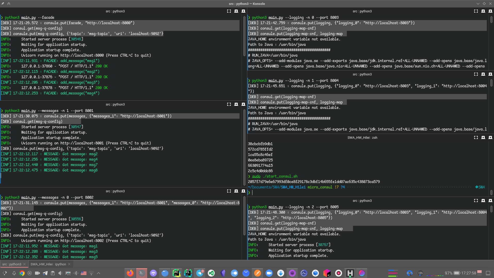
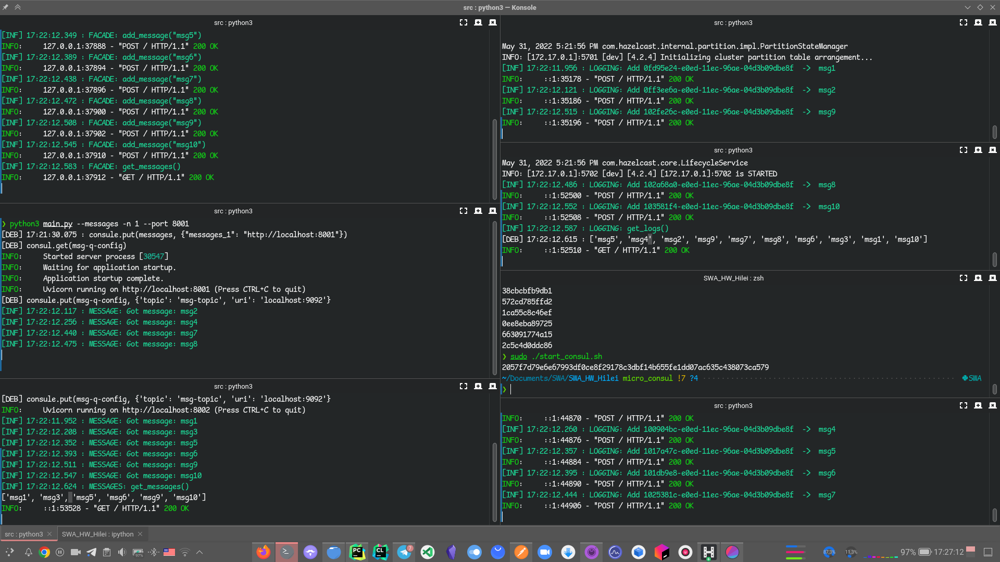
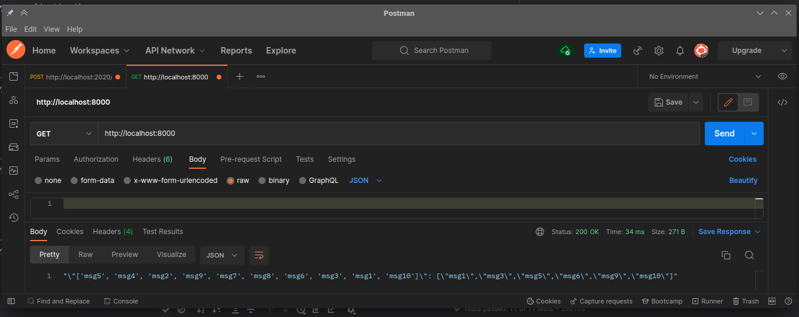
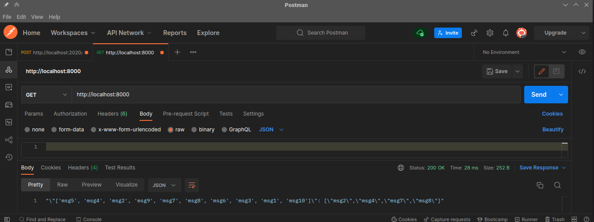

# SWA course - HW3

## Core libraries
- [fastapi](https://fastapi.tiangolo.com/)
- [requests](https://docs.python-requests.org/en/latest/)
- [hazelcast](https://hazelcast.com/clients/python-2/)

## Prerequisities
- [python](https://www.python.org/) 3.8+
- [anaconda](https://docs.anaconda.com/anaconda/install/index.html)

## Setup
```
conda env create -f environment.yml --name HW1
conda activate HW1
```

## Usage
```
usage: main.py [-h] [--config CONFIG] [--facade] [--logging] [--messages] [--number NUMBER]

optional arguments:
  -h, --help            show this help message and exit
  --config CONFIG, -c CONFIG
                        config with ports
  --facade              start facade service
  --logging             start logging service
  --messages            start messages service
  --number NUMBER, -n NUMBER
                        Number of service in case of replication
```

## Results:
- logs of microservices when starting:


- logs of microservices after requests:


- get facade request #1:

- 
- get facade request #:


- Video with starting all microservices, logs and requests - `./media/hw5/SWA_HW5_Pavlo_Hilei.mkv`


[//]: # (## Results:)

[//]: # (- Video with results: `./videos`)

[//]: # ()
[//]: # (### Screnshots)

[//]: # (Logs of all serices:)

[//]: # (![]&#40;./media/logs.png&#41;)

[//]: # ()
[//]: # (Get request:)

[//]: # (![]&#40;./media/get_req.png&#41;)